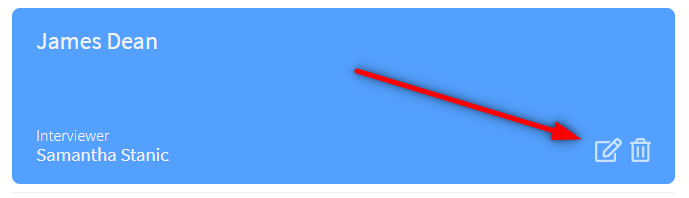

# Interview Scheduler

### The last scheduler you will ever need.

## Setup

To get started with our fabulous system please take the following steps.

- clone this wonderful repository
- make sure your API server is running.
- start the the webpack development server

## Cmds to get you started!

```sh
git clone git@github.com:aStrangeGoatInTheShadows/scheduler-mk2-electricBoogaloo.git

npm install

npm run
```

This should get you up and running this revolutionary new technology.

## Using the scheduler

A web browser will open an you will be presented with this

<p></p>

You can then click on one of the large + symbol to add a new appointment

<p></p>

Once you hit save, the data gets uploaded to the database and will persist until the end of time, or you delete it!

Thats where the buttons in the bottom right come into play! The one on left will let you change the name and the interviewer of your appointment! If you click on the right, button you will be prompted to delete it! Then you can just stay at home and have a beer!

<p></p>

If you have any problems, please feel free to reach out to some developers.
